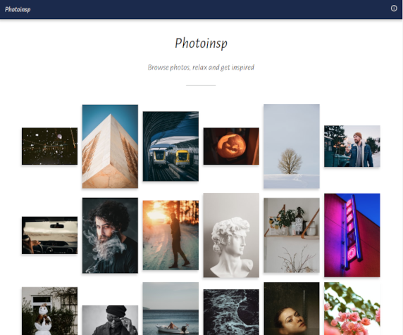

# Photoinsp

A web app displaying inspirational photos from [Unsplash API](https://unsplash.com/developers).

Current version on Heroku: https://photoinsp.herokuapp.com/



## Tech

### Front end

- React (Create React App with typescript template)
- Redux, Redux Thunk
- React Router

The front end is build with React using Create React App typescript template as the basis. React is a widely used JavaScript library for building single page applications. It has an active community behind it and it is growing and evolving. 

The app state is managed with Redux. Redux holds the app state centrally in one place which becomes especially useful when the project grows in size. Asynchronous requests to the server are implemented with the help of Redux Thunk.

Routing in the app is handled with React Router.

### Back end

- Node.js
- Express

The Express server is responsible for API calls. API key stays hidden from the front end when data from API is fetched using the proxy server and only the response data is sent back to the front end.

### Hosting

- Heroku
- GitHub

The app is hosted on Heroku and source code shared in GitHub.

## How to develop and deploy

### Development

You need to have Node.js and npm installed on your computer.

Rename ```.env-example``` as ```.env``` and add your [Unsplash API](https://unsplash.com/developers) key there.

In the root of the project directory, install the dependencies with:

```
npm install
```
And start the Express server in development mode:
```
npm run dev
```

The server runs at ```http://localhost:3001```.

Then, go to the ```/client``` directory, install dependencies and start the React app in development mode:

```
cd client
npm install
npm start
```

The front end runs at ```http://localhost:3000```.

### Deployment

The app is deployed to Heroku with the script:

```
npm run deploy
```

This script
1. Compiles ```server.ts``` to ```server.js```.
2. Goes to directory ```/client``` where the React front end is located.
3. Creates an optimized production build of the front end.
4. Returns to root directory.
5. Stages all changed files to git.
6. Creates a git commit of the latest build.
7. Pushes the latest build to Heroku.
8. Pushes the latest build to GitHub repository.